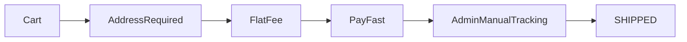
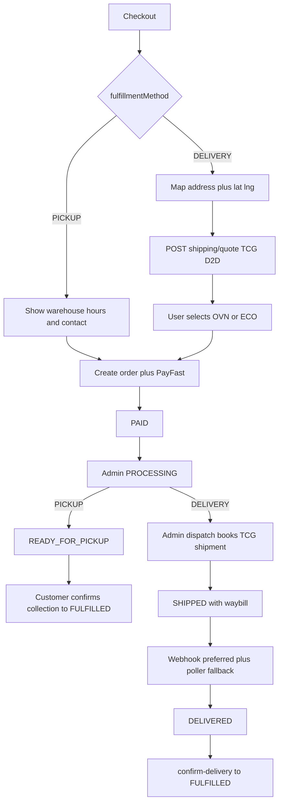

# Delivery Flow: Pickup + The Courier Guy

Production-grade plan for Pickup vs Delivery checkout, live The Courier Guy (ShipLogic) door-to-door rates, and admin-booked waybills. Implements across `satya_server_app` + `Satya_devotte_app`.

**Canonical path requested by product:** copy/rename this file to [`Delivery-flow.plan`](./Delivery-flow.plan) when Agent mode is available (plan mode cannot write non-`.md` files).

**API reference:** workspace Postman collection [`shiplogic.postman_collection.json`](../shiplogic.postman_collection.json) (Bearer token auth; sandbox `https://api.shiplogic.com`; production per TCG account / `api-tcg.co.za` or portal host).

---

## Decisions (locked)

- **Checkout methods:** `PICKUP` | `DELIVERY` only.
- **Delivery carrier:** The Courier Guy via ShipLogic. **Door-to-door (D2D) only** in v1 (no lockers).
- **Rate UX:** When Delivery is selected, show live TCG service levels filtered by `TCG_OFFERED_SERVICE_LEVELS` (default `OVN,ECO`) with prices; user must pick one before pay.
- **Waybill booking:** **Admin-triggered** after packing (`POST …/dispatch` books TCG then marks `SHIPPED`). Checkout only **quotes + snapshots** the rate into the order so PayFast totals stay correct. Avoids charging TCG for unpaid/cancelled orders.
- **Pickup fee:** Always `deliveryCharge = 0`. Show configured warehouse/pickup location (from `TCG_COLLECTION_ADDRESS_JSON` / ecommerce pickup settings).
- **Free-delivery threshold:** Still applies for Delivery as a **merchant subsidy** — customer pays `R0` when subtotal ≥ `freeDeliveryMinimum`, but the TCG quote snapshot is retained for ops/accounting.
- **Mock mode:** Honor existing `TCG_USE_MOCK=true` so local/test works without an API key.
- **Auth:** ShipLogic `Authorization: Bearer <api_key>` (not client-side). Fix `.env.test` comment that says `accountId|secret` — use the raw API key from Integrations → API Keys.

---

## Current state (baseline)



- Flat fee: `src/models/EcommerceSettings.js` + `src/services/ecommerceSettingsService.js`
- Checkout always requires address: `src/validations/orderValidation.js`, `src/services/orderService.js`
- Manual tracking: `PATCH /orders/:id/tracking`, `POST /orders/:id/dispatch`
- Flutter is delivery-only: `Satya_devotte_app` cart + `product_checkout_page.dart`
- Env stubs already in `.env.test` (TCG block) — **no client code yet**
- Email already defaults tracking URL to The Courier Guy public track page

---

## Target flows



---

## 1. Data model (`src/models/Order.js`)

Add:

- `fulfillmentMethod`: `DELIVERY` | `PICKUP` (required, indexed)
- Enrich `shippingAddress` with optional `lat`, `lng`, `suburb` / `localArea`, `enteredAddress` (needed for accurate ShipLogic rates); keep existing fields; **stop dropping `addressLine2`** in `normalizeShippingAddress`
- `shippingQuote` snapshot (immutable after checkout):
  - `provider: "TCG"`, `serviceLevelCode`, `serviceLevelName`, `rate`, `rateExcludingVat`, `quotedAt`, `rateRevisionId` / rating refs, `expiresAt` (quote TTL 30–60 min)
- `delivery` subdoc (email already peeks at `order.delivery.waybill`):
  - `shipmentId`, `waybill` / `customTrackingReference`, `shortTrackingReference`, `labelUrl`, `stickerUrl`, `status`, `bookedAt`, `lastSyncedAt`, `raw` (sanitized)
- Status enum extensions:
  - Add `READY_FOR_PICKUP`
  - Wire existing unused `OUT_FOR_DELIVERY` into the delivery transition map

### Status machines

| Method | Transitions |
|--------|-------------|
| DELIVERY | `PLACED → PROCESSING → SHIPPED → OUT_FOR_DELIVERY → DELIVERED → FULFILLED` (+ `CANCELLED` pre-ship) |
| PICKUP | `PLACED → PROCESSING → READY_FOR_PICKUP → FULFILLED` (customer confirm collection; no tracking required). Optional: admin can mark `DELIVERED` then customer confirms. |

**ShipLogic → Satya status mapping (tracking sync):**

| ShipLogic status | Satya `orderStatus` |
|------------------|---------------------|
| `submitted`, `collection-*`, `collected`, `at-hub`, `in-transit`, … | keep `SHIPPED` (update `delivery.status`) |
| `out-for-delivery` | `OUT_FOR_DELIVERY` |
| `delivered` | `DELIVERED` (then customer confirm → `FULFILLED`) |
| `cancelled`, `returned-to-sender`, `undeliverable` | flag + admin alert; do not auto-cancel paid order without review |

Rules:

- `SHIPPED` for Delivery requires successful TCG book **or** explicit admin override tracking (manual fallback for outages).
- Pickup never requires `tracking.trackingNumber`.
- Cancel paid Delivery: if TCG shipment exists and still cancellable, cancel via ShipLogic then refund path.

---

## 2. Backend: TCG client + shipping APIs

### Module layout

- `src/config/tcgConfig.js` — parse env (`TCG_API_KEY`, `TCG_API_ENV`, `TCG_USE_MOCK`, collection address/contact JSON, parcel defaults, offered levels, base URL overrides)
- `src/integrations/tcg/tcgClient.js` — HTTP client (Bearer auth, timeouts, retries, structured errors)
- `src/integrations/tcg/tcgMock.js` — deterministic fake rates/waybills when `TCG_USE_MOCK`
- `src/services/shippingQuoteService.js` — build rates request from warehouse + customer address + default parcels (`POST /rates`)
- `src/services/shippingShipmentService.js` — create shipment (`POST /shipments`), labels, cancel (`PUT` cancel), map tracking
- `src/jobs/tcgTrackingSyncJob.js` — interval from `TCG_TRACKING_SYNC_INTERVAL_MS` (default 15m) as fallback
- Prefer **ShipLogic webhooks** (tracking event) when account configured: `POST /api/v1/webhooks/tcg`

### Env (promote from `.env.test` into `.env.example`)

```
TCG_API_ENV=test|production
TCG_USE_MOCK=true|false
TCG_API_KEY=                 # Bearer token from ShipLogic Integrations → API Keys
TCG_API_BASE_URL=            # sandbox default https://api.shiplogic.com ; prod override if needed
TCG_OFFERED_SERVICE_LEVELS=OVN,ECO
TCG_DEFAULT_PARCEL_LENGTH_CM=40
TCG_DEFAULT_PARCEL_WIDTH_CM=30
TCG_DEFAULT_PARCEL_HEIGHT_CM=8
TCG_DEFAULT_PARCEL_WEIGHT_KG=2
TCG_TRACKING_SYNC_INTERVAL_MS=900000
TCG_COLLECTION_ADDRESS_JSON={...}
TCG_COLLECTION_CONTACT_JSON={...}
TCG_TRACKING_PUBLIC_BASE_URL=https://www.thecourierguy.co.za/track
```

### New / extended routes (`/api/v1`)

| Endpoint | Who | Purpose |
|----------|-----|---------|
| `POST /shipping/quote` | user | Body: address (+ lat/lng), optional cart items; returns filtered TCG rates |
| `GET /shipping/pickup-location` | user | Warehouse address, hours, contact for Pickup UI |
| `POST /orders/:id/dispatch` | admin | **Extend:** if Delivery + no waybill → book TCG using stored quote/service level, set tracking, `SHIPPED` |
| `POST /orders/:id/ready-for-pickup` | admin | Pickup only → `READY_FOR_PICKUP` + notify |
| `POST /orders/:id/confirm-delivery` | user | Extend: Pickup at `READY_FOR_PICKUP` confirms collection → `FULFILLED` |
| `POST /webhooks/tcg` | ShipLogic | Tracking events → update `delivery.status` / order status |

### Checkout / create order changes

`orderService.js` + `orderValidation.js` — conceptual payload:

```js
{
  fulfillmentMethod: "DELIVERY" | "PICKUP",
  shippingAddress: { /* required if DELIVERY; include lat/lng */ },
  shippingServiceLevelCode: "OVN", // required if DELIVERY
  contact: { fullName, phone } // required for PICKUP even without full address
}
```

Server must:

1. Re-quote (or validate quote within TTL) and **never trust client-supplied rate** for `deliveryCharge` / `totalAmount`.
2. Apply free-delivery subsidy if configured.
3. For Pickup: `deliveryCharge = 0`, store pickup location snapshot on order, skip TCG.
4. Persist `shippingQuote` + `fulfillmentMethod`.

---

## 3. Frontend — `Satya_devotte_app`

### Checkout / cart UX

1. **Method selector** first on cart + checkout: Pickup | Delivery.
2. **Delivery branch:** existing map/address flow; persist `lat`/`lng` from pin; call `POST /shipping/quote`; show TCG cards (name, ETA copy, price); selected level drives bill `deliveryCharge`.
3. **Pickup branch:** hide map; show pickup location card from `GET /shipping/pickup-location`; collect name + phone only; bill shows Delivery R0 / “Collect in store”.
4. Wire create-order body with `fulfillmentMethod` + `shippingServiceLevelCode`.

Key files:

- `lib/features/poojakit/presentation/pages/cart_screen.dart`
- `lib/features/poojakit/presentation/pages/product_checkout_page.dart`
- `lib/features/poojakit/state/poojakit_checkout_controller.dart`
- `lib/features/poojakit/data/models/address_model.dart`
- `lib/features/poojakit/data/repositories/poojakit_repository.dart`
- `lib/core/network/api_endpoints.dart`

### Order detail / list

- Conditional copy: “Pickup location” vs “Delivery location”.
- Hide courier tracking for Pickup; show “Ready for pickup” / “Collected”.
- Confirm button: “Confirm delivery” vs “Confirm collection”.

Files: `user_order_detail_screen.dart`, `admin_order_models.dart` (`OrderStatus` + new fields).

### Admin CMS

- Order list/detail: badge for Pickup vs Delivery.
- Delivery: **Book Courier Guy & Dispatch** (extended dispatch) + label/waybill link; keep manual tracking as fallback.
- Pickup: **Mark ready for pickup** action.
- Settings: pickup hours/instructions; flat fee remains fallback/legacy when TCG unavailable (prefer clear error + mock in test).

Files: `cms_pooja_kit_orders_content.dart`, `admin_orders_controller.dart`, ecommerce settings content.

---

## 4. Emails, FCM, invoices

Update `orderEmailService.js` + `fcmOrderNotifyService.js` + invoice service:

- Paid confirmation: branch Pickup vs Delivery copy.
- Admin paid-order inbox: include method + pickup vs ship address.
- Tracking email only for Delivery after TCG book.
- New: “Ready for pickup” email/push.
- Invoice: show method; zero shipping line for pickup; TCG waybill when present.

---

## 5. Production hardening

- **Idempotent booking:** store `delivery.shipmentId`; re-dispatch must not double-book.
- **Quote TTL:** reject stale `serviceLevelCode` at checkout; force re-quote.
- **Secrets:** API key server-only; never expose to Flutter.
- **Observability:** structured logs for quote/book/cancel; track TCG latency/failures.
- **Cancel path:** cancel TCG shipment before/with refund when waybill exists and still cancellable.
- **Address quality:** require lat/lng for Delivery quotes; validate SA postal/city; prefer full ShipLogic address shape (`street_address`, `local_area`, `zone`, `code`, `country`).
- **Parcel defaults:** use env defaults until products gain weight/dims.
- **Webhook security:** verify shared secret / source IP if ShipLogic provides one; idempotent event handling.
- **Tests:** unit tests for mock client, quote pricing + free-delivery subsidy, status machines per method; integration with `TCG_USE_MOCK=true`.
- **Rollout:** mock → sandbox key (`api.shiplogic.com`) → production credentials + real collection JSON.

---

## 6. Implementation order

1. Order schema + validations + status machine.
2. TCG config/client/mock + quote + pickup-location APIs (align with Postman collection).
3. Checkout/create-order pricing path (server re-quote).
4. Admin dispatch book + ready-for-pickup + webhook + tracking sync job.
5. Flutter checkout method UI + quote selection.
6. Flutter order detail + CMS actions.
7. Emails/FCM/invoice copy.
8. Sandbox E2E, then production credentials.

---

## Out of scope (v1)

- TCG lockers (D2L / L2L / locker picker UI)
- Multi-carrier comparison
- Per-SKU real parcel dimensions (defaults only)
- Customer address book persistence
