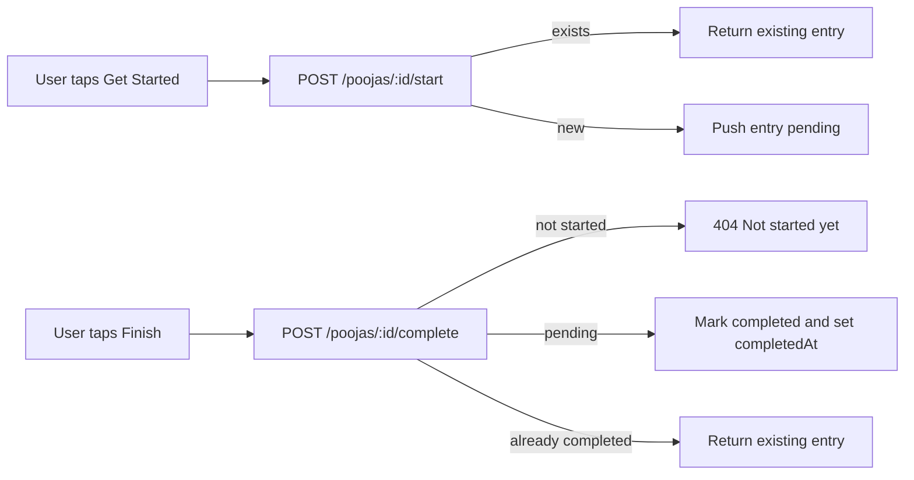

# Pooja Progress Tracking for Users

Track each user's interaction with poojas: clicking "Get Started" adds a `PENDING` entry to their user document; finishing the pooja flips that entry to `COMPLETED`.

## Assumptions (change here if needed before implementation)

- Storage: **embedded array on `User`** (matches your phrasing "add pooja to that user schema"). If your user count gets large or you want history/analytics, switch to a separate `UserPoojaProgress` collection later.
- States: **`PENDING`** and **`COMPLETED`** only.
- Re-starts: **idempotent** — clicking "Get Started" again does nothing if a row already exists; we never auto-reset a `COMPLETED` row.
- Only **`role: "user"`** can start/complete (admins/superadmins are blocked — they manage poojas, they don't consume them).
- Pooja must be **`status: "APPROVED"`** to be startable.
- Out of scope (call out if you want them in): payment gating for `accessType: "PAID"` poojas, `streakCount` updates on completion, push notifications on completion.

## High-level flow



## Files to change

### 1. [src/models/User.js](src/models/User.js)

Add an embedded sub-schema and a `poojaProgress` array on `User`:

```js
const poojaProgressSchema = new mongoose.Schema(
  {
    pooja: { type: mongoose.Schema.Types.ObjectId, ref: "Pooja", required: true },
    status: { type: String, enum: ["PENDING", "COMPLETED"], default: "PENDING" },
    startedAt: { type: Date, default: Date.now },
    completedAt: { type: Date, default: null },
  },
  { _id: true, timestamps: false }
);

// inside userSchema:
poojaProgress: { type: [poojaProgressSchema], default: [] },
```

Add an index for fast lookup of a user's entry per pooja:

```js
userSchema.index({ "poojaProgress.pooja": 1 });
userSchema.index({ "poojaProgress.status": 1 });
```

### 2. [src/controllers/poojaController.js](src/controllers/poojaController.js)

Add three handlers (placed near `getMyPoojas`):

- `startPooja(req, res, next)`
  - Load pooja by `req.params.id`; 404 if missing; 400 if `status !== "APPROVED"`.
  - Atomic guard against double-start race using `$addToSet`-style update:
    ```js
    const updated = await User.findOneAndUpdate(
      { _id: req.user.userId, "poojaProgress.pooja": { $ne: pooja._id } },
      { $push: { poojaProgress: { pooja: pooja._id, status: "PENDING", startedAt: new Date() } } },
      { new: true }
    );
    ```
  - If `updated` is null, the entry already existed — fetch the user and return that entry as-is (idempotent).
  - Respond with the single progress entry (not the full user).

- `completePooja(req, res, next)`
  - Update the matching entry in one query:
    ```js
    const updated = await User.findOneAndUpdate(
      { _id: req.user.userId, "poojaProgress.pooja": pooja._id, "poojaProgress.status": "PENDING" },
      { $set: { "poojaProgress.$.status": "COMPLETED", "poojaProgress.$.completedAt": new Date() } },
      { new: true }
    );
    ```
  - If `updated` is null:
    - Check whether entry exists at all:
      - none → 404 "You haven't started this pooja yet."
      - already `COMPLETED` → return existing entry (idempotent).
  - Optionally: stub a hook for `streakCount` (deferred unless you say yes).

- `getMyPoojaProgress(req, res, next)`
  - Paginated list: `?page=&limit=&status=PENDING|COMPLETED`.
  - Use aggregation: `$match` user, `$unwind` `poojaProgress`, optional `$match` status, `$lookup` Pooja, `$sort` by `startedAt` desc, `$skip`/`$limit`.
  - Return `{ poojas: [...], pagination: { page, limit, total, totalPages } }` matching existing convention.

Export the three new handlers.

### 3. [src/validations/poojaValidation.js](src/validations/poojaValidation.js)

- Reuse `poojaIdParamsSchema` for the two action routes (no body needed).
- Add:
  ```js
  const myProgressQuerySchema = Joi.object({
    page: Joi.number().integer().min(1).default(1),
    limit: Joi.number().integer().min(1).max(100).default(10),
    status: Joi.string().valid("PENDING", "COMPLETED").optional(),
  });
  ```
  Export it.

### 4. [src/routes/poojaRoutes.js](src/routes/poojaRoutes.js)

Mount three new routes (with `authenticate`, NOT `authorizeRoles("admin")`):

```js
router.post(
  "/:id/start",
  authenticate,
  validate(poojaIdParamsSchema, "params"),
  startPooja
);

router.post(
  "/:id/complete",
  authenticate,
  validate(poojaIdParamsSchema, "params"),
  completePooja
);

router.get(
  "/my-progress",
  authenticate,
  validate(myProgressQuerySchema, "query"),
  getMyPoojaProgress
);
```

**Route order matters** — declare `/my-progress` **before** `/:id` so it doesn't get captured as an ID. Also declare it before the existing `GET /:id` route.

Add three corresponding `@swagger` doc blocks.

### 5. [src/controllers/poojaController.js](src/controllers/poojaController.js) — guard role

In `startPooja` and `completePooja`, reject admin/superadmin callers:

```js
if (req.user.role !== "user") {
  throw new HttpError("Only end users can start or complete a pooja.", 403);
}
```

## API surface

| Method | Path | Auth | Body | Purpose |
|---|---|---|---|---|
| `POST` | `/api/v1/poojas/:id/start` | user | — | Add or return PENDING entry |
| `POST` | `/api/v1/poojas/:id/complete` | user | — | Flip PENDING → COMPLETED |
| `GET` | `/api/v1/poojas/my-progress` | user | — | List user's progress, paginated, optional `?status=` |

Response shape for start/complete:

```json
{
  "success": true,
  "statusCode": 200,
  "data": {
    "progress": {
      "_id": "67100000000000000000aaaa",
      "pooja": "6712a4f2c1d3e4f5a6b7c890",
      "status": "PENDING",
      "startedAt": "2026-05-11T08:03:21.000Z",
      "completedAt": null
    }
  },
  "message": "Pooja started"
}
```

Response shape for `my-progress` mirrors `getMyPoojas` (poojas + pagination), but each item embeds the user's progress entry.

## Error cases

| HTTP | Reason |
|---|---|
| 400 | Pooja not yet APPROVED |
| 403 | Caller is admin/superadmin |
| 404 | Pooja not found / user has not started this pooja yet (on complete) |

## Deferred (call out if you want them included)

- **Payment gating**: for `accessType: "PAID"` poojas, block start until a payment record exists. Needs a `Payment` model first.
- **Streak increment** on COMPLETED.
- **Notification** on COMPLETED (FCM topic / direct token).
- **History mode**: if you later want repeat-counts ("you've done this 4 times"), migrate to a separate `UserPoojaProgress` collection — the embedded model can be backfilled with `$out`.
