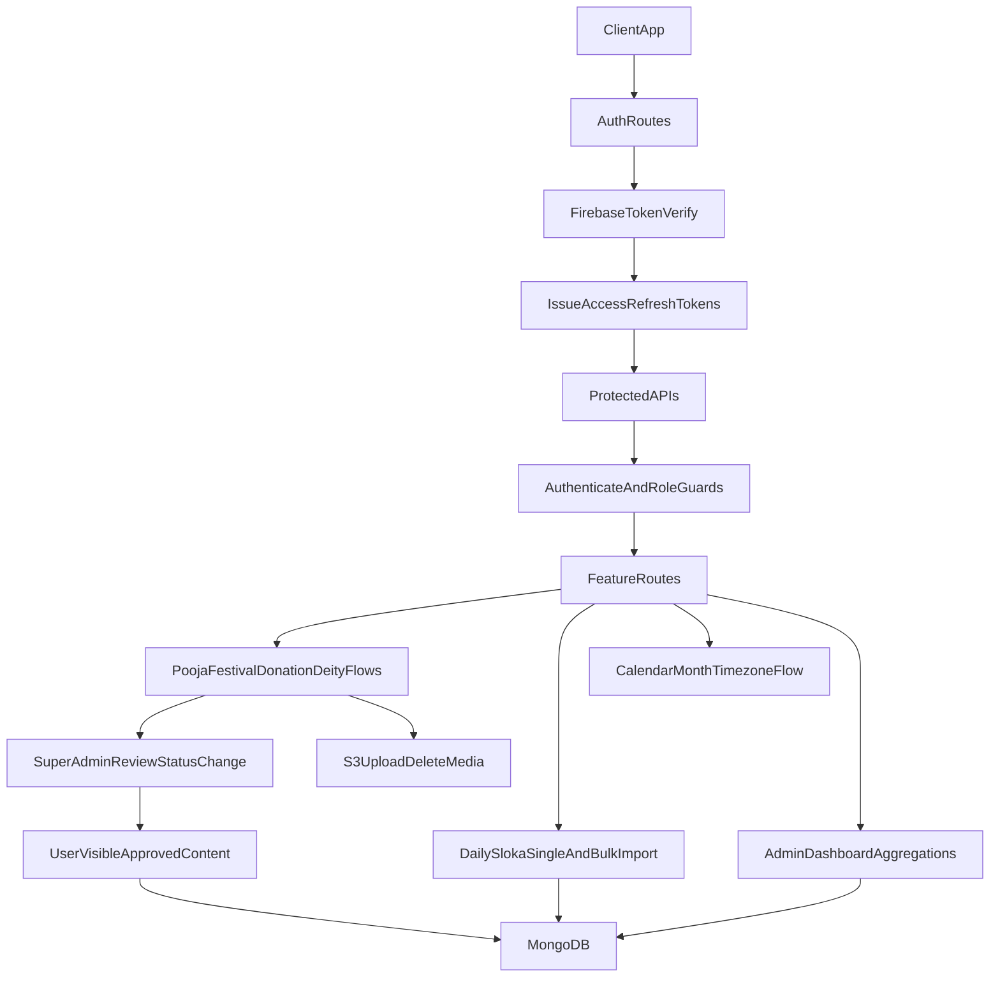

# Current System Flow (Admin / Super Admin / User)

## 1) Role Model

- **User**
  - Can access authenticated read APIs (home, calendar, daily sloka, own profile).
  - Sees only approved/visible business content in user-facing flows.
- **Admin**
  - Can create and manage domain records (poojas, festivals, donations, deities).
  - Can access admin dashboards and user management lists.
  - Cannot review/approve unless also super admin.
- **Super Admin**
  - All admin abilities.
  - Can review/approve/reject (`review` endpoints).
  - Can access `/all` status-wide listing endpoints and destructive admin actions.

Auth context is set in `authenticate` middleware as:
- `req.user.userId`
- `req.user.role`
- `req.user.isSuperAdmin`

---

## 2) Route Map (High-Level)

Mounted under `/api/v1` via [src/routes/index.js](src/routes/index.js):

- `auth` → [src/routes/authRoutes.js](src/routes/authRoutes.js)
- `admin` → [src/routes/adminRoutes.js](src/routes/adminRoutes.js)
- `poojas` → [src/routes/poojaRoutes.js](src/routes/poojaRoutes.js)
- `festivals` → [src/routes/festivalRoutes.js](src/routes/festivalRoutes.js)
- `donations` → [src/routes/donationRoutes.js](src/routes/donationRoutes.js)
- `deities` → [src/routes/deityRoutes.js](src/routes/deityRoutes.js)
- `daily-slokas` → [src/routes/dailySlokaRoutes.js](src/routes/dailySlokaRoutes.js)
- `user-home` → [src/routes/userHomeRoutes.js](src/routes/userHomeRoutes.js)
- `calendar` → [src/routes/calendarRoutes.js](src/routes/calendarRoutes.js)

Also mounted separately:
- `/api/upload` → [src/routes/uploadRoutes.js](src/routes/uploadRoutes.js)

---

## 3) Core Schemas

### User ([src/models/User.js](src/models/User.js))
- `firebaseUid` (unique), `email`, `phone`
- `provider` + `linkedProviders[]` (firebase-linked provider model)
- `role` (`user|admin`), `isSuperAdmin`
- `createdBy`, `lastActiveAt`

### RefreshToken ([src/models/RefreshToken.js](src/models/RefreshToken.js))
- `userId`, `token` (unique), `expiryDate`

### AdminLog ([src/models/AdminLog.js](src/models/AdminLog.js))
- `action`, `performedBy`, `targetUser`

### Pooja ([src/models/Pooja.js](src/models/Pooja.js))
- Core: `title`, `deity(ObjectId->Deity)`, `category`, `difficulty`, `duration`, `description`
- Content blocks:
  - `purpose`, `deitySummary`, `preparation`
  - `steps[]` (with `stepNumber`, `title`, `description`, `subSteps`)
  - `mantra`, `spiritualMeaning`, `guidance`, `completion`
- Media/relations: `media.images/audio/videos[]`, `festivalIds[]`
- Workflow: `status` (`DRAFT|PENDING|APPROVED|REJECTED|QUEUED`), `rating`, `createdBy`

### Festival ([src/models/Festival.js](src/models/Festival.js))
- `title`, `description`, `date`, `endDate`
- `image`, `rituals[]`, `category`, geo + notification fields
- Workflow: `status`, `isVisible`, `reviewedBy`, `reviewedAt`
- Lifecycle: `isDeleted` (soft delete), `createdBy`

### Donation ([src/models/Donation.js](src/models/Donation.js))
- `title`, `description`, `image`, `createdBy`
- Workflow: `status`, `isVisible`

### Deity ([src/models/Deity.js](src/models/Deity.js))
- `name`, `alternate_names[]`, `description`, `roles[]`
- `sections[]` with nested `title` and `content[]`
- `rituals[]`, `media.images/audio/videos[]`
- Workflow: `status`, `createdBy`

### DailySloka ([src/models/DailySloka.js](src/models/DailySloka.js))
- `sloka`, `author`, `meaning`, `contemplation`, `prayer`
- `date`, `dateKey` (unique per day), `createdBy`

---

## 4) Feature Flows

## Authentication & Session
- Firebase ID token verified in [src/controllers/authController.js](src/controllers/authController.js).
- User upsert/login with provider linkage (`provider`, `linkedProviders`).
- JWT access+refresh tokens issued; refresh tokens stored in DB.
- `authenticate` throttles `lastActiveAt` update every 5 minutes.

## Admin Management
- Promote/demote admin, list admin/regular users, delete regular user.
- Admin actions logged in `AdminLog`.
- Dashboard aggregates:
  - users/admin counts
  - today active users
  - status counts for festivals/poojas/donations
  - today sloka

## Pooja
- Create/update with rich nested payload + optional media file upload.
- Admin create/update defaults to `PENDING`; super admin can set status directly.
- Review endpoint updates status.
- Read APIs:
  - `/` with pagination/status filters
  - `/my` creator filtered list
  - `/all` super-admin all statuses
  - `/:id` with status gating for non-admin

## Festival
- Create/update with date parsing and optional image upload.
- Review toggles `isVisible` on `APPROVED`.
- Soft delete via `isDeleted`.
- Listing endpoints support pagination/status on admin/super-admin flows.

## Donation
- Create/update with image upload.
- Review toggles `isVisible` on `APPROVED`.
- Listing endpoints support pagination/status on admin/super-admin flows.

## Deity
- CRUD + review endpoint.
- `GET /deities` supports pagination + status filtering.
- Review updates deity status.

## Daily Sloka
- Single create/update (upsert by `dateKey`).
- Fetch by date or today.
- Bulk import (`.xlsx` / `.docx` table):
  - header aliases supported
  - date supports `dd-mm-yyyy` and `yyyy-mm-dd`
  - upsert by `dateKey`
  - returns row-level import summary

## Calendar
- Month/year endpoint with timezone-aware month range.
- Returns festivals and poojas for month.
- Non-admin sees approved-only subset.

## Upload/S3
- Generic media upload via S3 service.
- Sloka import uses dedicated document-upload middleware.
- Multer errors normalized by global error handler.

---

## 5) Status/Approval Pattern

- Common status vocabulary across business entities:
  - `DRAFT`, `PENDING`, `APPROVED`, `REJECTED`, `QUEUED`
- Typical path:
  - **Admin create/update** → `PENDING`
  - **Super admin review** → `APPROVED/REJECTED/QUEUED`
- Visibility gating:
  - Donation/Festival: `isVisible` used with status
  - Pooja/Deity: primarily status-based filtering

---

## 6) Cross-Cutting Technical Behaviors

- Joi validation with `stripUnknown: true` in [src/middleware/validate.js](src/middleware/validate.js)
- Rate limiting + security middleware in [src/app.js](src/app.js)
- Timezone utilities in [src/utils/timezone.js](src/utils/timezone.js) for calendar and day boundaries
- Swagger setup in [src/config/swagger.js](src/config/swagger.js)

---

## 7) End-to-End Flow Diagram

